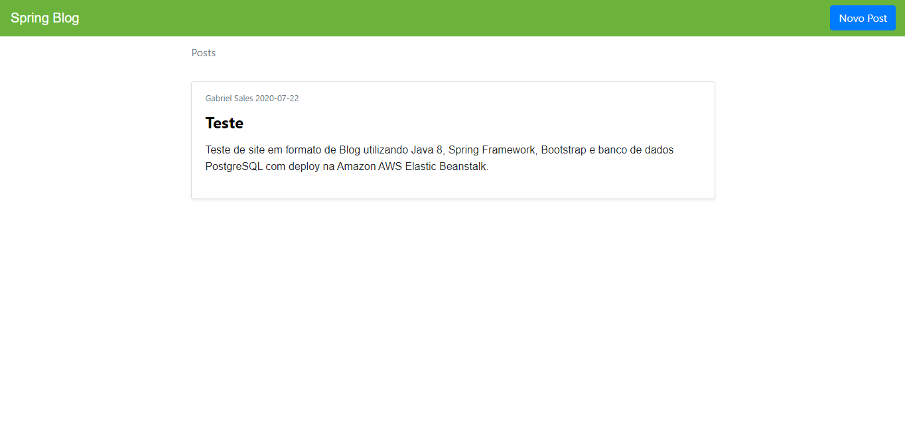

# Spring Blog
> Site em formato de Blog utilizando o Spring Framework.

# Tecnologias utilizadas
- [JDK 8: Necessário para executar o projeto Java](https://www.oracle.com/br/java/technologies/javase/javase-jdk8-downloads.html)
- [Maven: Necessário para realizar o build do projeto Java](https://maven.apache.org/)
- [intellij: Para desenvolvimento do projeto](http://www.eclipse.org/downloads/packages/eclipse-ide-java-ee-developers/oxygen3a)
- [PostgreSQL: Banco de dados](https://www.postgresql.org/)
- [Spring Boot: Utilizado para desenvolver o serviço Web](https://spring.io/)
- [Thymeleaf: Para integrar o HTML com o Web Service](https://www.thymeleaf.org/)
- [Bootstrap: Framework pro Front-End](https://getbootstrap.com/)

